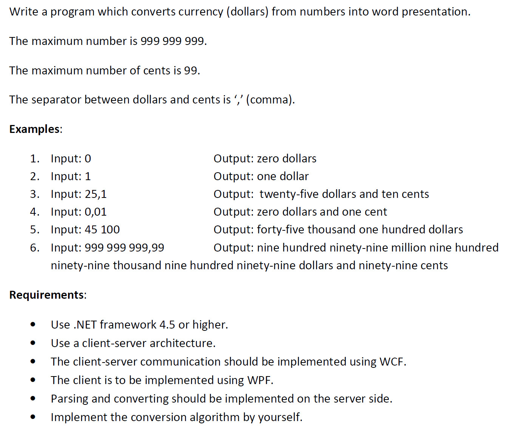
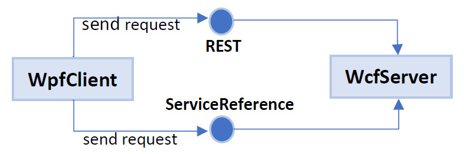
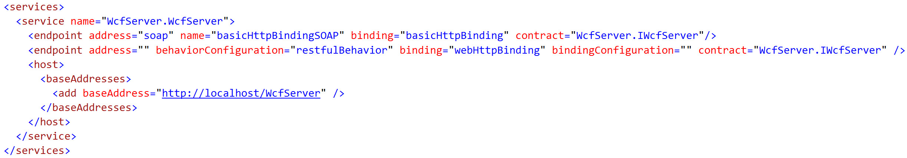
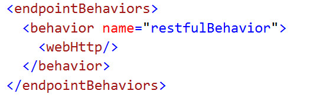
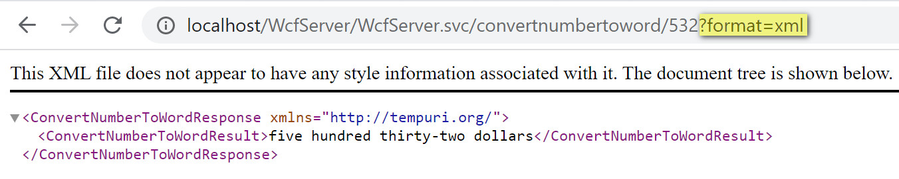
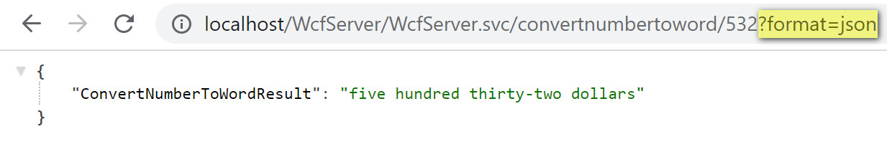
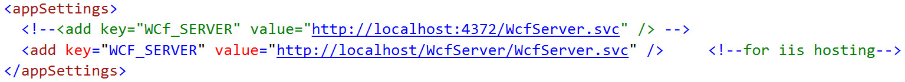
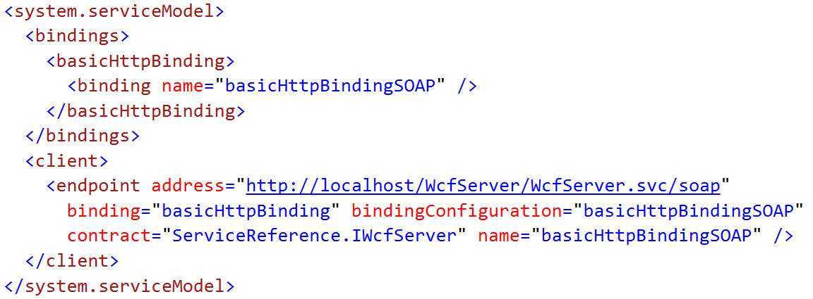
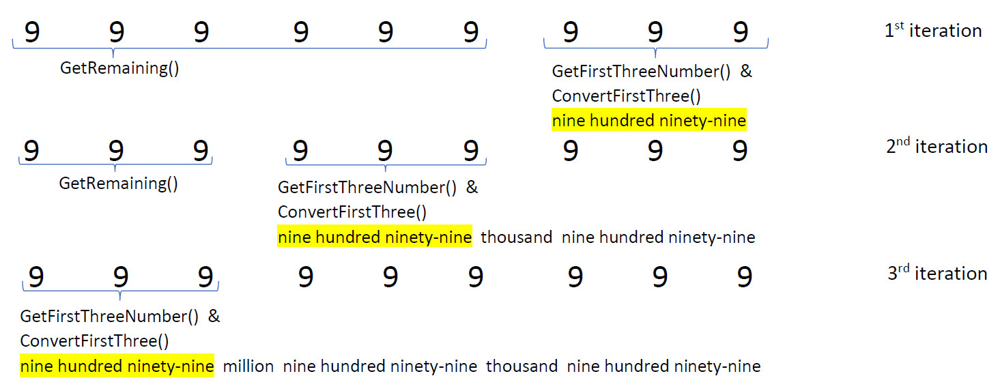
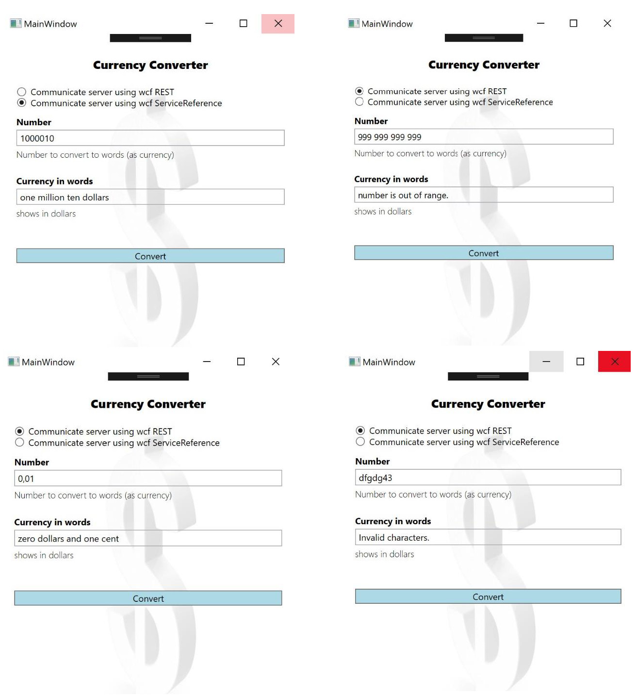

<h2>WPF-WCF-Communication</h2>

<h3>Senario covered</h3>

<h3>Tools, Framework & Environment used</h3>
	<ul>
		<li>Windows 10</li>
		<li>Visual Studio Community Edition 2019 (v.-16.1.1)</li>
		<li>.NET Framework 4.7.2</li>
		<li>IIS (v.-10)</li>
	</ul>

<h3>Client-Server communication flow</h3>

I have implemented 2 approaches to communicate from client (WPF) to server (WCF).

<ol>
	<li>Communication using WCF REST</li>
	<li>Communication using Service Reference</li>
</ol>

<h3>Explanation on WcfServer</h3>
<ol>
	<li>
  	<ul>
		  <li>Added rest-endpoint and rest-behaviour in the web.config file to enable REST request-response.</li>
		  <li>If we only have rest-endpoint in WCF, ServiceReference in WPF will not work as REST does not pass over any metadata.</li>
		  <li>To solve this, soap-endpoint is added here in WCF. (App.config file in WPF will have this endpoint)</li>
		  
      
	  </ul>
  </li>
	<li>
    <ul>
		  <li>In order to expose the service, “WebInvoke” attribute has been used in IWcfServer.cs interface. Here, URI Template defines the URL format by which this method is identified / linked.</li>
      
    </ul>
  </li>
  	<li>
    <ul>
		  <li>OutgoingResponseFormat.cs class has been used to dynamically send the response either in json or xml format according to client needs.</li>
    </ul>
  </li>
</ol>

<h3>XML format</h3>
 
<h3>Json format</h3>

<h3>Explanation on WpfClient</h3>
<ol>
	<li>
  	<ul>
		  <li>For consuming WCF-REST in WPF application, I have used WebClient which helps to create the entry point for performing web request.</li>
		  <li>WebClient has been configured in WcfRequest.cs file and JavaScriptSerializer has been used to deserialize the json response coming from WcfServer.</li>
		  <li>Before running WpfClient application check the WcfServer address in App.config file.</li>
		  

<b>Important : Host the WcfServer in iis in order to establish a client-server communication</b>

	  </ul>
  </li>
<li>
    <ul>
		  <li>ServiceReference has been added using one of the following addresses</li>
	    	    <a>	http://localhost:4372/WcfServer.svc </a>   &nbsp;&nbsp;  or    
		    <a>	http://localhost/WcfServer/WcfServer.svc </a>
    </ul>
    <ul>
		  <li>After adding the WCF ServiceReference the following endpoints are by default added into the App.config file</li>
	    
    </ul>
     <ul>
	<li>If any changes happen in WcfServer, it is important to update the ServiceReference to get the impact and as well as check the endpoint in the App.config.</li>
    </ul>
         <ul>
	<li>Before running WpfClient application check the WcfServer address at the endpoint in App.config.</li>
    </ul>
	     <ul>
	<li>In order to update the WcfServer address, do the followings:  
	    &nbsp;&nbsp;&nbsp; Right-click on <b>ServiceReference</b> -> go to <b>Configure Service Reference…</b> -> change the <b>Address</b>
	</li>
    </ul>
  </li>
</ol>

<h3>Logic Explanation from High-level</h3>

For example: assuming an input of 999999999,99

    <ul>
	<li>Split the number first using (,) separator. Now I have separated 99999999 (dollars) and 99 (cents).</li>  
	
    </ul>

<h3>WpfClient sample outputs</h3>

